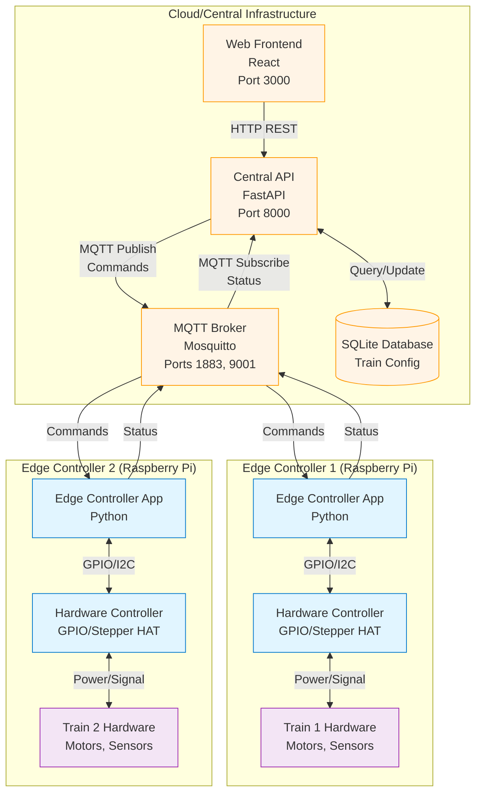
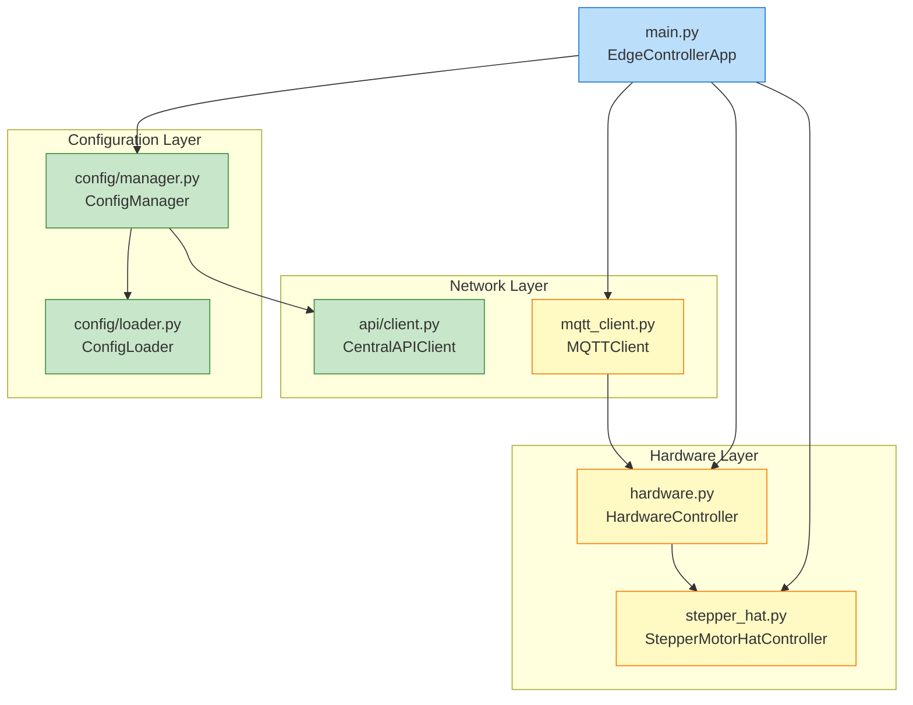
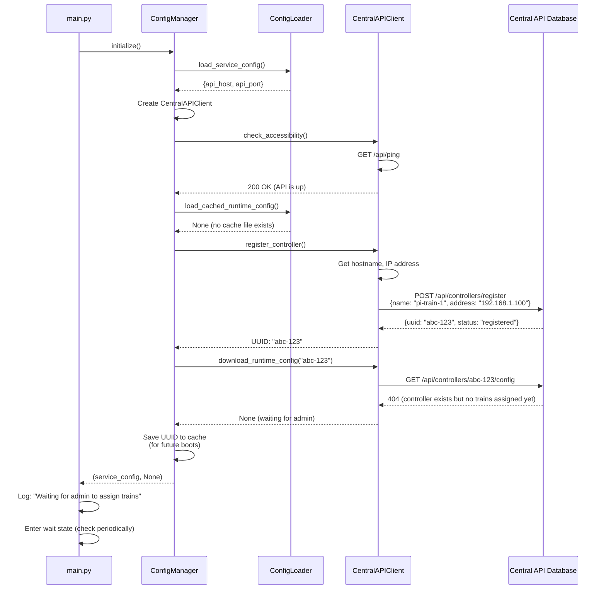
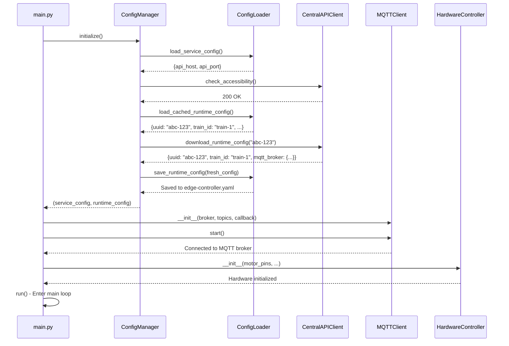
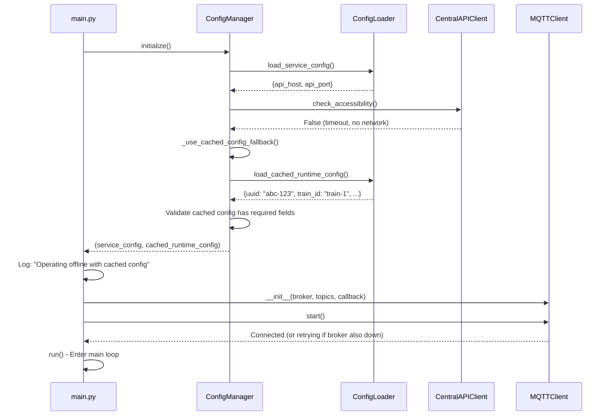
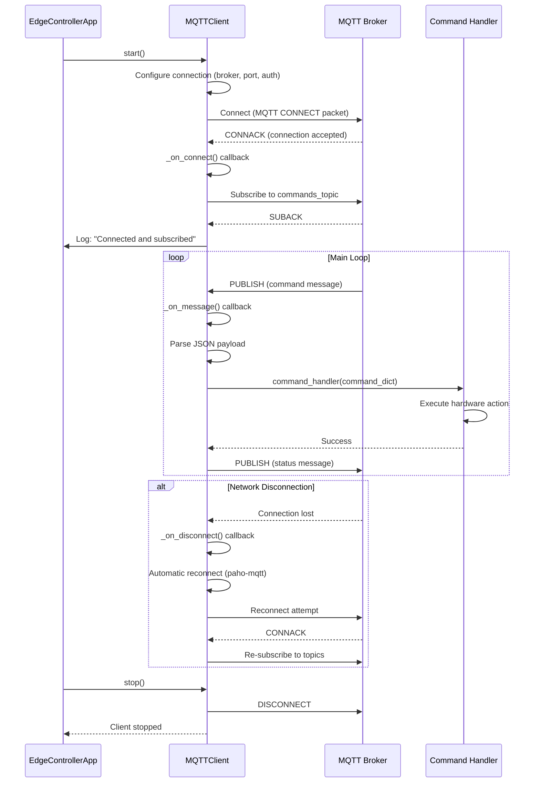
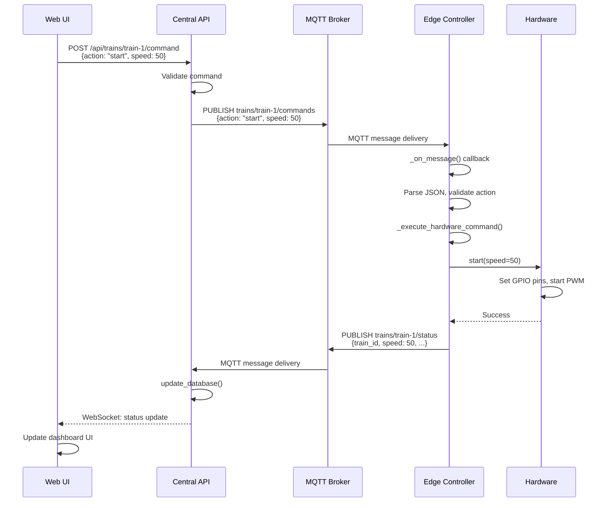
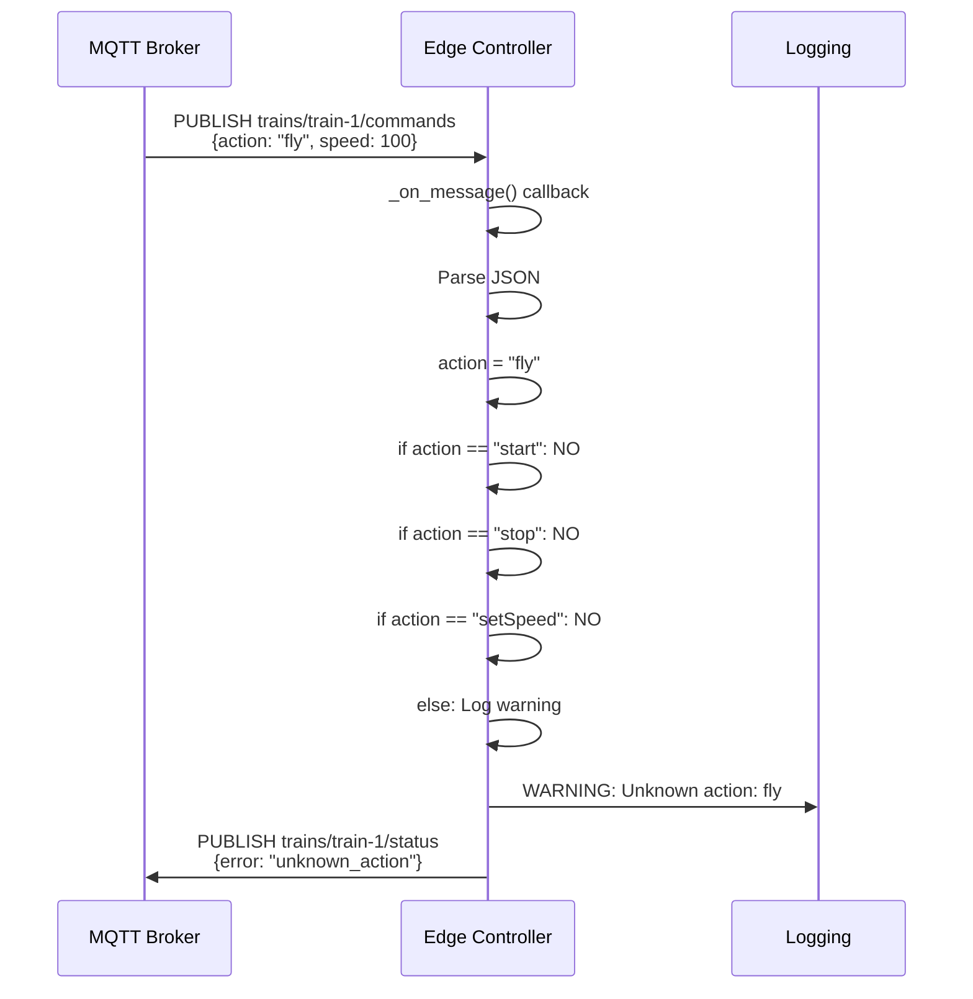
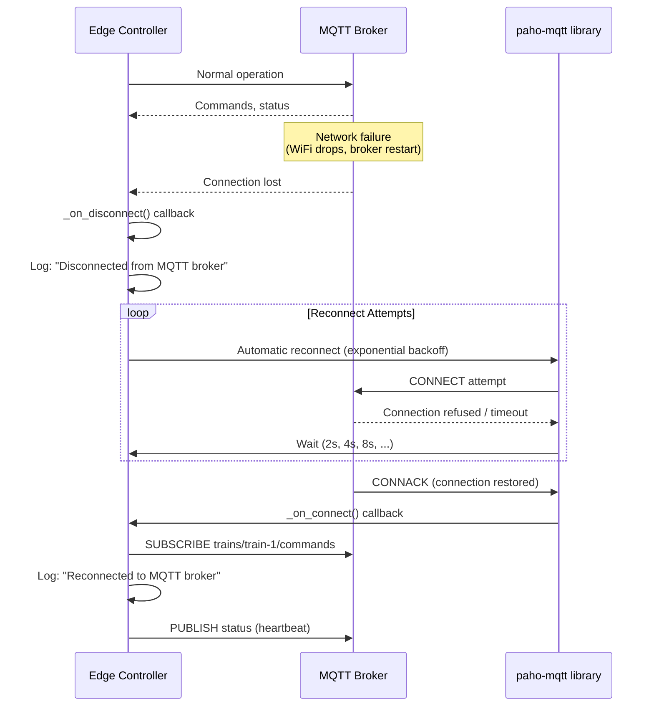

# Edge Controller Architecture

**Version:** 1.0  
**Last Updated:** 2024-01-08  
**Status:** Living Document

---

## Table of Contents

- [Executive Summary](#executive-summary)
- [System Context](#system-context)
- [Component Architecture](#component-architecture)
- [Configuration Lifecycle](#configuration-lifecycle)
- [MQTT Communication](#mqtt-communication)
- [Hardware Abstraction](#hardware-abstraction)
- [Operational Sequences](#operational-sequences)
- [Error Handling & Resilience](#error-handling--resilience)
- [Security Considerations](#security-considerations)
- [Deployment Scenarios](#deployment-scenarios)
- [Functional Requirements](#functional-requirements)
- [Performance Characteristics](#performance-characteristics)
- [Future Enhancements](#future-enhancements)

---

## Executive Summary

### What Is This?

The Edge Controller is a Python application that runs on Raspberry Pi devices to control individual model trains. It acts as the bridge between physical hardware (motors, sensors, lights) and the distributed control system (Central API, MQTT broker, Web UI).

**In 30 seconds:**

- Registers itself with the Central API and receives a unique UUID
- Downloads train-specific configuration (which train to control, MQTT topics)
- Listens for commands via MQTT (`trains/{train_id}/commands`)
- Executes hardware actions (start motor, set speed, stop)
- Publishes status updates via MQTT (`trains/{train_id}/status`)
- Operates offline using cached configuration when the API is unavailable

### Target Audience

| Audience | Why Read This |
|----------|---------------|
| **Developers** | Understand the codebase structure, add features, fix bugs |
| **Operators** | Deploy, monitor, and troubleshoot edge controllers in production |
| **Hardware Engineers** | Integrate new motor controllers, sensors, or HATs |
| **System Architects** | Understand how edge controllers fit into the larger distributed system |

### Quick Links

- **Setup Guide:** See [`edge-controllers/pi-template/README.md`](../../edge-controllers/pi-template/README.md)
- **API Reference:** See [`docs/edge-controllers/AI_SPECS.md`](AI_SPECS.md)
- **Troubleshooting:** See [Error Handling & Resilience](#error-handling--resilience)
- **MQTT Topics:** See [`docs/mqtt-topics.md`](../mqtt-topics.md)
- **Central API Documentation:** See [`central_api/docs/ARCHITECTURE.md`](../central_api/docs/ARCHITECTURE.md) and [`central_api/docs/AI_SPECS.md`](../central_api/docs/AI_SPECS.md)

---

## System Context

### High-Level System Diagram

The edge controller is one component in a distributed model train control system. Here's how it fits into the larger architecture:



### Communication Patterns

| Protocol | Layer | Purpose | Reliability | Typical Latency |
|----------|-------|---------|-------------|-----------------|
| **HTTP REST** | API Client | Registration, config download, health checks | Synchronous request-response | 50-200ms |
| **MQTT** | MQTT Client | Real-time commands and status updates | Best-effort asynchronous | 15-50ms |
| **GPIO/I2C** | Hardware | Direct motor/sensor control | Deterministic, synchronous | <5ms |

**Why This Architecture?**

1. **HTTP for Configuration:** Request-response is ideal for infrequent, high-value operations (registration once, config download on startup). Easy to debug, well-understood failure modes.

2. **MQTT for Real-Time Control:** Publish-subscribe enables low-latency, asynchronous commands. Multiple subscribers (monitoring tools, logging) can consume the same events without controller code changes.

3. **Separation of Concerns:** Configuration (HTTP) and control (MQTT) are decoupled. Controllers can operate offline with cached config while maintaining real-time command execution.

### Where This Fits

- **Edge Layer:** This controller runs on Raspberry Pi hardware at the "edge" (close to the physical trains)
- **Central Orchestration:** The Central API and MQTT broker coordinate all controllers
- **User Interface:** The Web UI sends commands through the Central API, which publishes to MQTT
- **Multiple Controllers:** Each train has its own edge controller (1:1 mapping)
- **Scalability:** Adding a new train = deploying a new edge controller + registering with the API

---

## Component Architecture

### Internal Component Diagram



### Component Responsibilities

| Component | File | Responsibility | External Dependencies |
|-----------|------|---------------|----------------------|
| **EdgeControllerApp** | [`main.py`](../../edge-controllers/pi-template/app/main.py) | Application lifecycle, orchestration, command routing | None (pure coordination) |
| **ConfigManager** | [`config/manager.py`](../../edge-controllers/pi-template/app/config/manager.py) | Configuration state machine, registration flow | [`CentralAPIClient`](../../edge-controllers/pi-template/app/api/client.py), [`ConfigLoader`](../../edge-controllers/pi-template/app/config/loader.py) |
| **ConfigLoader** | [`config/loader.py`](../../edge-controllers/pi-template/app/config/loader.py) | File I/O for YAML configs (service + runtime) | `yaml`, `pathlib` |
| **CentralAPIClient** | [`api/client.py`](../../edge-controllers/pi-template/app/api/client.py) | HTTP communication with Central API | `requests`, `socket` |
| **MQTTClient** | [`mqtt_client.py`](../../edge-controllers/pi-template/app/mqtt_client.py) | MQTT pub/sub, command handling, status publishing | `paho-mqtt` |
| **HardwareController** | [`hardware.py`](../../edge-controllers/pi-template/app/hardware.py) | Generic GPIO control (motors, lights, sensors) | `gpiozero` |
| **StepperMotorHatController** | [`stepper_hat.py`](../../edge-controllers/pi-template/app/stepper_hat.py) | Waveshare stepper HAT control (singleton) | `gpiozero`, `lgpio` |

### Data Flow Architecture

```mermaid
graph TD
    START[Application Start]
    LOAD_SVC[Load Service Config<br/>edge-controller.conf]
    CHECK_API{Central API<br/>Accessible?}
    LOAD_CACHE[Load Cached Config<br/>edge-controller.yaml]
    HAS_CACHE{Cached UUID<br/>Exists?}
    REGISTER[Register with API<br/>POST /api/controllers/register<br/>Get UUID]
    DOWNLOAD[Download Runtime Config<br/>GET /api/controllers/{uuid}/config]
    HAS_CONFIG{Runtime Config<br/>Available?}
    INIT_MQTT[Initialize MQTT Client<br/>Subscribe to commands topic]
    INIT_HW[Initialize Hardware Controller<br/>Setup GPIO pins]
    RUN[Main Loop:<br/>Listen for MQTT commands<br/>Execute hardware actions<br/>Publish status updates]
    WAIT[Wait State:<br/>Registered but not assigned<br/>No train configuration]
    FAIL[FAIL:<br/>No API + No Cache<br/>Cannot start]

    START --> LOAD_SVC
    LOAD_SVC --> CHECK_API

    CHECK_API -->|No| LOAD_CACHE
    LOAD_CACHE --> HAS_CACHE
    HAS_CACHE -->|Yes, has UUID| INIT_MQTT
    HAS_CACHE -->|No| FAIL

    CHECK_API -->|Yes| LOAD_CACHE
    HAS_CACHE -->|Yes, has UUID| DOWNLOAD
    HAS_CACHE -->|No| REGISTER
    REGISTER --> DOWNLOAD
    DOWNLOAD --> HAS_CONFIG
    HAS_CONFIG -->|Yes, has train_id| INIT_MQTT
    HAS_CONFIG -->|No train assigned| WAIT

    INIT_MQTT --> INIT_HW
    INIT_HW --> RUN

    classDef success fill:#c8e6c9,stroke:#388e3c
    classDef failure fill:#ffcdd2,stroke:#c62828
    classDef wait fill:#fff9c4,stroke:#f57c00
    classDef decision fill:#e1bee7,stroke:#8e24aa

    class INIT_MQTT,INIT_HW,RUN success
    class FAIL failure
    class WAIT wait
    class CHECK_API,HAS_CACHE,HAS_CONFIG decision
```

**Key Decision Points:**

1. **API Accessible?** If yes, attempt to register or refresh config. If no, fall back to cached config.
2. **Cached UUID Exists?** If yes, skip registration and try to download fresh config. If no, register as new controller.
3. **Runtime Config Available?** If yes, initialize MQTT and hardware. If no, enter wait state (valid state - admin hasn't assigned trains yet).

---

## Configuration Lifecycle

### Configuration Files

#### 1. Service Configuration (`edge-controller.conf`)

**Purpose:** Static, version-controlled configuration that defines how the controller connects to infrastructure.

**Location:** [`edge-controllers/pi-template/app/edge-controller.conf`](../../edge-controllers/pi-template/app/edge-controller.conf)

**Contents:**

```yaml
central_api_host: "localhost"  # or "api.example.com"
central_api_port: 8000
logging_level: "INFO"  # DEBUG, INFO, WARNING, ERROR
```

**Who manages it:** DevOps/operators. Rarely changes. Deployed via configuration management (Ansible, Docker volumes, etc.).

#### 2. Runtime Configuration (`edge-controller.yaml`)

**Purpose:** Dynamic configuration downloaded from Central API. Contains train-specific settings.

**Location:** [`edge-controllers/pi-template/app/edge-controller.yaml`](../../edge-controllers/pi-template/app/edge-controller.yaml) (auto-generated)

**Contents:**

```yaml
uuid: "abc-def-123-456"  # Controller's unique identifier
train_id: "train-1"      # Assigned train ID
mqtt_broker:
  host: "mqtt-broker"
  port: 1883
  username: null  # Optional MQTT auth
  password: null
status_topic: "trains/train-1/status"
commands_topic: "trains/train-1/commands"
```

**Who manages it:** Generated by Central API. Admin assigns trains to controllers via API/UI. Controllers cache it locally for offline operation.

#### 3. Environment Variables (Optional Overrides)

```bash
LOCAL_DEV=true          # Enable simulation mode (no hardware required)
CONTROLLER_ID=custom    # Override controller ID (debugging)
MQTT_BROKER=mqtt.local  # Override MQTT broker host
MQTT_PORT=1883          # Override MQTT broker port
```

### Bootstrap Flow (First Boot)



**Outcome:** Controller is registered and has a UUID, but cannot operate until admin assigns it to a train via the Central API/UI.

### Refresh Flow (Subsequent Boots)



**Outcome:** Controller has fresh config from API, connects to MQTT, initializes hardware, and begins listening for commands.

### Offline Fallback Flow



**Outcome:** Controller operates with last known good configuration. When API becomes available again, config will refresh on next boot or periodic check.

### Design Decision: Why Two Config Files?

**Alternatives Considered:**

1. **Single Config File:** Combine service and runtime config in one YAML file.
   - **Rejected:** Service config is static (versioned), runtime config is dynamic (generated). Mixing them complicates deployment and versioning.

2. **Environment Variables Only:** No config files, everything via env vars.
   - **Rejected:** Complex nested structures (MQTT broker settings) are cumbersome as env vars. Config files provide better readability and validation.

3. **Config Server (Consul, etcd):** Fetch all config from a distributed key-value store.
   - **Rejected:** Over-engineered for current scale. Adds operational complexity (another service to run). YAML files + HTTP API is simpler.

**Chosen Approach:**

- **Service config file:** Infrastructure settings (rarely change, version-controlled)
- **Runtime config file:** Train-specific settings (admin-managed, cached for offline)
- **Environment variables:** Overrides for development/debugging only

**Benefits:**

- Clear separation of concerns
- Offline operation via cached runtime config
- Easy to reason about (service config = infrastructure, runtime config = application)

---

## MQTT Communication

### Topic Structure

All MQTT topics follow the pattern `trains/{train_id}/...` where `{train_id}` is assigned by the Central API.

| Topic | Direction | Purpose | QoS | Retain |
|-------|-----------|---------|-----|--------|
| `trains/{train_id}/commands` | Subscribe | Receive commands from Central API/UI | 0 | No |
| `trains/{train_id}/status` | Publish | Send status updates to Central API/UI | 0 | No |

#### Design Decision: QoS 0 (At most once)

- **Why not QoS 1 or 2?** Commands are idempotent (can be safely retried). Status updates are frequent (every 1-30s), so losing one is acceptable.
- **Benefits:** Lower overhead, higher throughput, simpler client implementation.
- **Trade-offs:** Commands may be lost if network is unstable. Mitigated by command retries at UI level.

### Message Schemas

#### Command Messages (Subscribed)

**Topic:** `trains/{train_id}/commands`

**Start Motor:**

```json
{
  "action": "start",
  "speed": 50
}
```

**Stop Motor:**

```json
{
  "action": "stop"
}
```

**Change Speed:**

```json
{
  "action": "setSpeed",
  "speed": 75
}
```

**Validation Rules:**

- `action` field is required (string)
- `speed` is optional, integer 0-100 (defaults to 50)
- Unknown actions are logged and ignored (no error response)

#### Status Messages (Published)

**Topic:** `trains/{train_id}/status`

**Payload:**

```json
{
  "train_id": "train-1",
  "speed": 50,
  "voltage": 12.3,
  "current": 0.8,
  "position": "section_A",
  "timestamp": "2024-01-08T12:34:56Z"
}
```

**Fields:**

- `train_id`: Train identifier (string)
- `speed`: Current motor speed, 0-100 (integer)
- `voltage`: Motor voltage in volts (float)
- `current`: Motor current in amps (float)
- `position`: Track section/sensor position (string)
- `timestamp`: ISO 8601 timestamp (string)

**Publishing Frequency:**

- After each command execution (immediate)
- Periodic heartbeat every 30 seconds (configurable)
- On hardware state change (sensor trigger, emergency stop)

### MQTT Connection Lifecycle



**Error Handling:**

1. **Connection Failure:** Retry with exponential backoff (handled by `paho-mqtt` library)
2. **Invalid JSON:** Log error, ignore message, continue listening
3. **Unknown Action:** Log warning, ignore command, publish error status
4. **Hardware Failure:** Log exception, publish error status, do NOT crash

### Design Decision: Why MQTT Over HTTP?

**Alternatives Considered:**

1. **HTTP Polling:** Edge controller polls Central API for commands every N seconds.
   - **Rejected:** High latency (seconds), wastes bandwidth polling when no commands exist.

2. **WebSockets:** Maintain WebSocket connection to Central API.
   - **Rejected:** More complex protocol, requires custom server implementation, harder to scale (one connection per controller).

3. **HTTP Server on Edge:** Central API makes HTTP requests to edge controller's local server.
   - **Rejected:** Requires edge controllers to be publicly addressable (NAT traversal issues), security concerns (open ports on Pi).

#### Chosen: MQTT Pub/Sub

**Benefits:**

- **Low Latency:** Commands delivered in 15-50ms (vs. seconds for polling)
- **Decoupled:** Publishers and subscribers don't need to know about each other
- **Scalable:** Broker handles N publishers and M subscribers efficiently
- **Multiple Consumers:** Monitoring tools, logging services can subscribe to same topics without controller changes
- **Offline Resilience:** QoS and retained messages can handle temporary disconnections

**Trade-offs:**

- Additional infrastructure (MQTT broker must be deployed and maintained)
- Debugging is harder (can't replay requests like HTTP)
- No built-in authentication/authorization (must configure MQTT broker ACLs)

---

## Hardware Abstraction

### Plugin Pattern for Hardware Controllers

The edge controller uses a **plugin pattern** to support different motor controllers, sensor HATs, and GPIO configurations. This allows the same codebase to work with:

- Generic GPIO (via [`gpiozero`](../../edge-controllers/pi-template/app/hardware.py))
- Waveshare Stepper Motor HAT (via I2C)
- Adafruit Motor HAT
- Custom Arduino-based controllers (via serial)
- **Simulated hardware** (for development without physical devices)

### Interface Contract

All hardware plugins must implement:

```python
class HardwareController:
    def start(self, speed: int = 50) -> None:
        """Start motor at specified speed (0-100)."""

    def stop(self) -> None:
        """Stop motor immediately."""

    def set_speed(self, speed: int) -> None:
        """Change motor speed (0-100) without stopping."""

    def cleanup(self) -> None:
        """Release GPIO pins and cleanup resources."""
```

### Hardware Controller Implementations

#### 1. Generic GPIO Controller ([`hardware.py`](../../edge-controllers/pi-template/app/hardware.py))

**Use Case:** Simple DC motors, lights, sensors using Raspberry Pi GPIO pins directly.

**Features:**

- Motor speed control (PWM on configurable pins)
- Light control (digital on/off)
- Sensor reading (digital input)

**Example Usage:**

```python
from hardware import HardwareController

hw = HardwareController(
    motor_pins=[17, 18],  # GPIO pins for motors
    light_pins=[22, 23],  # GPIO pins for lights
    sensor_pins=[24, 25]  # GPIO pins for sensors
)

hw.set_motor_speed(motor_index=0, speed=50)
hw.turn_on_light(light_index=0)
sensor_value = hw.read_sensor(sensor_index=0)
```

#### 2. Stepper Motor HAT Controller ([`stepper_hat.py`](../../edge-controllers/pi-template/app/stepper_hat.py))

**Use Case:** Waveshare stepper motor HAT for precise motor control via I2C.

**Features:**

- Stepper motor control (steps, direction, speed)
- Singleton pattern (only one instance can access I2C bus)
- Emergency stop support

**Example Usage:**

```python
from stepper_hat import StepperMotorHatController

hw = StepperMotorHatController()  # Singleton instance
hw.enable_motor()
hw.start(speed=50, direction=1)  # 1=forward, -1=reverse
hw.set_speed(speed=75)
hw.stop()
hw.cleanup()
```

#### 3. Simulator (No Hardware)

**Use Case:** Development and testing on non-Pi systems (laptops, CI servers).

**Features:**

- Logs all hardware commands
- No actual GPIO operations
- Useful for unit/integration tests

**Activation:**

```bash
export LOCAL_DEV=true
python app/main.py  # Runs with simulator
```

**Code:**

```python
class StepperMotorSimulator:
    def start(self, speed: int = 50) -> None:
        logger.info(f"[SIMULATOR] Starting motor at speed {speed}")

    def stop(self) -> None:
        logger.info(f"[SIMULATOR] Stopping motor")
```

### Design Decision: Why Plugin Pattern?

**Alternatives Considered:**

1. **Monolithic Hardware Module:** One class with if/else for different hardware types.
   - **Rejected:** Hard to test, hard to extend, violates Single Responsibility Principle.

2. **Configuration-Driven:** Define hardware type in config, load corresponding module.
   - **Considered:** Good for runtime flexibility, but adds complexity. Current approach is simpler.

3. **Hardware Abstraction Library:** Use external library (e.g., `RobotPy`, `RPi.GPIO`).
   - **Partial:** We use `gpiozero` as the base, but wrap it for consistency and testability.

#### Chosen: Plugin Pattern + Dependency Injection

**Benefits:**

- **Testable:** Mock hardware controller in unit tests
- **Extensible:** Add new hardware by implementing the interface
- **Development-Friendly:** Simulator mode works everywhere (no Pi required)
- **Clean Separation:** Hardware logic isolated from business logic

**Implementation:**

```python
# main.py
if HARDWARE_AVAILABLE:
    from stepper_hat import StepperMotorHatController
    self.hardware_controller = StepperMotorHatController()
else:
    self.hardware_controller = StepperMotorSimulator()

# Later in code
self.hardware_controller.start(speed)  # Works regardless of implementation
```

---

## Operational Sequences

### Happy Path: Command Execution



**Timing:**

- User action to hardware response: **50-100ms** (typical)
- Status update visible in UI: **100-200ms** (typical)

### Error Scenario: Invalid Command



**Outcome:** Unknown commands are logged but do NOT crash the controller. Status message indicates error for debugging.

### Recovery Scenario: MQTT Disconnection



**Behavior:**

- Controller continues running (does not crash)
- Hardware state is preserved (motor keeps running at last commanded speed)
- Commands received during disconnection are LOST (QoS 0)
- On reconnect, status is immediately published to sync state

---

## Error Handling & Resilience

### Error Scenarios & Responses

| Scenario | Detection | Response | Recovery |
|----------|-----------|----------|----------|
| **Central API Unreachable** | HTTP timeout on startup | Use cached config | Refresh on next boot when API is available |
| **MQTT Broker Down** | Connection refused | Log error, retry with backoff | Automatic reconnect via `paho-mqtt` |
| **Invalid Command JSON** | JSON parse exception | Log error, ignore message | Continue listening for next command |
| **Hardware Failure** | GPIO exception | Log error, publish error status | Requires manual intervention (check wiring) |
| **Missing Config File** | File not found exception | Fail fast with clear error message | Deploy config file, restart controller |
| **Incomplete Cached Config** | Missing required fields | Attempt to download fresh config | If API unavailable, fail fast |

### Retry Strategies

#### HTTP API Calls (Registration, Config Download)

**Strategy:** Exponential backoff with max retries

```python
# api/client.py
def check_accessibility(self) -> bool:
    for attempt in range(self.max_retries):  # default: 5
        try:
            response = requests.get(url, timeout=self.timeout)
            if response.status_code == 200:
                return True
        except RequestException as exc:
            logger.warning(f"Attempt {attempt + 1}/{self.max_retries}: {exc}")

        if attempt < self.max_retries - 1:
            time.sleep(self.retry_delay * (attempt + 1))  # 2s, 4s, 6s, 8s, 10s

    return False
```

**Configuration:**

- **Default Retries:** 5
- **Initial Delay:** 2 seconds
- **Backoff:** Linear (2s, 4s, 6s, 8s, 10s)
- **Total Timeout:** ~30 seconds

**Rationale:** Registration is critical but infrequent. Generous retries handle temporary network glitches without delaying startup too much.

#### MQTT Reconnection

**Strategy:** Automatic reconnection handled by `paho-mqtt` library

```python
# mqtt_client.py
self.client = mqtt.Client()
self.client.on_disconnect = self._on_disconnect

def _on_disconnect(self, client, userdata, rc):
    if rc != 0:
        logger.warning(f"Unexpected MQTT disconnection (code {rc}). Reconnecting...")
        # paho-mqtt handles reconnection automatically
```

**Configuration:**

- **Automatic:** Built into `paho-mqtt.Client()`
- **Backoff:** Exponential (1s, 2s, 4s, 8s, ...)
- **Max Interval:** 120 seconds
- **Persistent:** Retries indefinitely

**Rationale:** MQTT is the real-time command channel. Indefinite retries ensure controller reconnects when network is restored.

### Graceful Degradation

#### Scenario: API Unavailable, Cached Config Exists

```python
# config/manager.py
if not self.api_client.check_accessibility():
    logger.warning("Central API not accessible, using cached config")
    return self._use_cached_config_fallback()
```

**Outcome:** Controller operates with last known configuration. Functionality:

- ✅ Receives and executes MQTT commands
- ✅ Publishes status updates
- ✅ Hardware control works normally
- ❌ Cannot re-register or download fresh config
- ❌ Config changes (new train assignment) won't be picked up until API is available

**Use Case:** Network partition, API maintenance, or deployment. Controller continues operating trains without interruption.

### Logging Strategy

**Log Levels:**

| Level | Use Case | Example |
|-------|----------|---------|
| **DEBUG** | Development only | `DEBUG: Received MQTT message: {raw_payload}` |
| **INFO** | Normal operations | `INFO: Started motor at speed 50` |
| **WARNING** | Recoverable issues | `WARNING: MQTT disconnected, retrying...` |
| **ERROR** | Failures requiring attention | `ERROR: Hardware command failed: GPIO timeout` |

**Configuration:**

```python
# main.py
logging.basicConfig(
    level=logging.INFO,  # Production: INFO, Development: DEBUG
    format="%(asctime)s [%(levelname)s] %(name)s: %(message)s"
)
```

**Log Destinations:**

- **Console:** stdout (captured by systemd or Docker logs)
- **Future:** File rotation (7-day retention)
- **Future:** Syslog or centralized logging (Loki, Elasticsearch)

---

## Security Considerations

### Threat Model

| Threat | Attack Vector | Mitigation | Priority |
|--------|---------------|------------|----------|
| **Unauthorized Command Execution** | Attacker publishes to MQTT commands topic | MQTT ACLs, username/password | HIGH |
| **Man-in-the-Middle** | Network eavesdropping | TLS for MQTT (future) | MEDIUM |
| **Physical Access** | Direct access to Raspberry Pi | Physical security, boot password | MEDIUM |
| **Code Injection** | Malicious command payload | JSON validation, no `eval()` | HIGH |
| **Denial of Service** | Flood controller with commands | Rate limiting (future) | LOW |

### Security Controls

#### 1. MQTT Authentication

**Current State:** Optional username/password authentication

```yaml
# edge-controller.yaml
mqtt_broker:
  host: "mqtt-broker"
  port: 1883
  username: "edge-controller-1"  # Optional
  password: "${MQTT_PASSWORD}"   # Injected via env var
```

**Configuration:**

```bash
# Inject password via environment variable (not in config file)
export MQTT_PASSWORD="secure-password-here"
python app/main.py
```

**Future Enhancement:** TLS/SSL for encrypted MQTT traffic

#### 2. Input Validation

**All MQTT commands are validated:**

```python
# mqtt_client.py
def _on_message(self, client, userdata, msg):
    try:
        command = json.loads(msg.payload.decode())
    except json.JSONDecodeError:
        logger.error("Invalid JSON in MQTT message")
        return  # Ignore malformed messages

    action = command.get("action")
    if action not in ["start", "stop", "setSpeed"]:
        logger.warning(f"Unknown action: {action}")
        return  # Ignore unknown commands
```

**Protection Against:**

- JSON injection
- Command injection
- Buffer overflows (Python's `json` module is safe)

#### 3. Secrets Management

**DO NOT:**

- ❌ Hardcode passwords in source code
- ❌ Commit secrets to Git
- ❌ Log passwords or sensitive data

**DO:**

- ✅ Use environment variables for secrets
- ✅ Use Docker secrets or Kubernetes secrets in production
- ✅ Rotate passwords periodically

#### 4. Code Security Scanning

**Tools:**

- **Bandit:** Python code security scanner (runs in CI)
- **Safety:** Dependency vulnerability scanner
- **Trivy:** Docker image vulnerability scanner

**CI Pipeline:**

```bash
# .github/workflows/ci-security.yml
- name: Run Bandit
  run: bandit -r app/ -ll
- name: Run Safety
  run: safety check --file requirements.txt
- name: Scan Docker Image
  run: trivy image edge-controller:latest
```

#### 5. Network Segmentation

**Recommended Deployment:**

```text
┌─────────────────────────────────────┐
│  Public Internet                     │
└────────────┬────────────────────────┘
             │
        ┌────▼────┐
        │ Firewall │
        └────┬────┘
             │
┌────────────▼──────────────┐
│  DMZ / Management VLAN     │
│  - Web UI (HTTPS only)     │
│  - Central API (internal)  │
└────────────┬───────────────┘
             │
┌────────────▼──────────────┐
│  Edge Controller VLAN      │
│  - MQTT Broker (no public) │
│  - Edge Controllers        │
└───────────────────────────┘
```

**Firewall Rules:**

- **Allow:** Web UI → Central API (HTTPS)
- **Allow:** Central API → MQTT Broker (MQTT/TLS)
- **Allow:** Edge Controllers → MQTT Broker (MQTT/TLS)
- **Deny:** All other traffic to edge VLAN
- **Deny:** Direct internet access from edge controllers

---

## Deployment Scenarios

### Local Development (Docker Compose)

**Use Case:** Test full stack locally without hardware

**Setup:**

```bash
cd infra/docker
docker-compose up --build
```

**Services Started:**

- Eclipse Mosquitto MQTT broker (ports 1883, 9001)
- Central API (port 8000)
- Edge controller (simulation mode)
- Web frontend (port 3000)

**Environment:**

```yaml
# docker-compose.yml
edge-controller:
  environment:
    - LOCAL_DEV=true  # Enable simulation mode
    - MQTT_BROKER=mqtt
    - MQTT_PORT=1883
```

**Testing:**

```bash
# Send test command
mosquitto_pub -h localhost -t "trains/train-1/commands" \
  -m '{"action":"start","speed":50}'

# Subscribe to status
mosquitto_sub -h localhost -t "trains/+/status"
```

### Raspberry Pi Deployment (Systemd Service)

**Use Case:** Production deployment on physical Raspberry Pi

**Installation:**

```bash
# On Raspberry Pi
git clone <repository-url>
cd edge-controllers/pi-template

# Install dependencies
pip3 install -r requirements.txt

# Configure service config
cp examples/edge-controller.conf app/edge-controller.conf
vim app/edge-controller.conf  # Update central_api_host

# Install systemd service
sudo cp examples/edge-controller.service /etc/systemd/system/
sudo systemctl enable edge-controller
sudo systemctl start edge-controller

# Check status
sudo systemctl status edge-controller
sudo journalctl -u edge-controller -f
```

**Systemd Service File:**

```ini
[Unit]
Description=Edge Controller for Model Train
After=network.target

[Service]
Type=simple
User=pi
WorkingDirectory=/home/pi/edge-controllers/pi-template/app
ExecStart=/usr/bin/python3 main.py
Restart=on-failure
RestartSec=10s
Environment="PYTHONUNBUFFERED=1"

[Install]
WantedBy=multi-user.target
```

**Health Monitoring:**

```bash
# Check if controller is registered
curl http://central-api:8000/api/controllers

# Check MQTT connection
mosquitto_sub -h mqtt-broker -t "trains/+/status" -C 1
```

### Kubernetes Deployment

**Use Case:** Scale to many controllers in a cluster

**Manifest:** [`infra/k8s/manifests/edge-controller-deployment.yaml`](../../infra/k8s/manifests/edge-controller-deployment.yaml)

**Key Features:**

- ConfigMap for service config
- Secret for MQTT credentials
- Persistent volume for cached config
- Health checks (liveness, readiness)

**Deployment:**

```bash
kubectl apply -f infra/k8s/manifests/
kubectl get pods -l app=edge-controller
kubectl logs -f edge-controller-abc123
```

**Scaling:**

```bash
# Deploy 10 edge controllers
kubectl scale deployment edge-controller --replicas=10
```

### Production Considerations

**Monitoring:**

- **Metrics:** Prometheus exporter for command latency, status publish frequency, hardware errors
- **Logs:** Centralized logging (Loki, Elasticsearch) for debugging
- **Alerts:** PagerDuty/Slack alerts for controller disconnections

**High Availability:**

- **MQTT Broker:** Deploy MQTT cluster (EMQX, VerneMQ) for fault tolerance
- **Central API:** Deploy API replicas behind load balancer
- **Edge Controllers:** Auto-restart on failure (systemd, Kubernetes)

**Backup & Recovery:**

- **Config Backup:** Back up `edge-controller.yaml` to S3/NFS daily
- **Disaster Recovery:** Re-register controller with Central API (UUID is preserved in backup)

---

## Functional Requirements

### FR1: Controller Registration

**Requirement:** Edge controller shall register with Central API on first boot and obtain a unique UUID.

**Implementation:** [`api/client.py::register_controller()`](../../edge-controllers/pi-template/app/api/client.py)

**Flow:**

1. Get hostname and IP address
2. POST to `/api/controllers/register` with `{name, address}`
3. Receive `{uuid, status}` response
4. Cache UUID in `edge-controller.yaml`

**Acceptance Criteria:**

- ✅ UUID is globally unique (verified by Central API)
- ✅ Registration survives controller restart (UUID is cached)
- ✅ Duplicate registrations return existing UUID (idempotent)

**Test Coverage:**

- Unit test: `test_api_client.py::test_register_controller_success`
- Integration test: `test_config_flow.py::test_full_config_initialization_new_controller`

---

### FR2: Configuration Management

**Requirement:** Controller shall download runtime configuration from Central API and cache it locally.

**Implementation:** [`config/manager.py::initialize()`](../../edge-controllers/pi-template/app/config/manager.py)

**Flow:**

1. Check if cached config exists (has UUID)
2. If yes, attempt to download fresh config from API
3. If download fails, use cached config (graceful degradation)
4. If no cached config, register as new controller

**Acceptance Criteria:**

- ✅ Operates with cached config when API is down
- ✅ Refreshes config on reconnect
- ✅ Validates config structure before use

**Test Coverage:**

- Unit test: `test_config_loader.py::test_load_cached_runtime_config`
- Integration test: `test_config_flow.py::test_config_initialization_existing_controller`

---

### FR3: MQTT Command Reception

**Requirement:** Controller shall subscribe to `trains/{train_id}/commands` and execute valid commands.

**Implementation:** [`mqtt_client.py::_on_message()`](../../edge-controllers/pi-template/app/mqtt_client.py)

**Supported Commands:**

- `{"action": "start", "speed": 50}` - Start motor
- `{"action": "stop"}` - Stop motor
- `{"action": "setSpeed", "speed": 75}` - Change speed

**Acceptance Criteria:**

- ✅ Invalid JSON is logged and ignored
- ✅ Unknown actions are logged and ignored
- ✅ Commands are idempotent (can retry safely)

**Test Coverage:**

- Unit test: `test_mqtt_client.py::test_on_message_valid_command`
- E2E test: `test_controller_lifecycle.py::test_command_handling_flow`

---

### FR4: Status Publishing

**Requirement:** Controller shall publish status updates to `trains/{train_id}/status`.

**Implementation:** [`mqtt_client.py::publish_status()`](../../edge-controllers/pi-template/app/mqtt_client.py)

**Triggers:**

- After each command execution (immediate)
- Periodic heartbeat every 30 seconds
- On hardware state change

**Status Fields:**

```json
{
  "train_id": "train-1",
  "speed": 50,
  "voltage": 12.0,
  "current": 0.8,
  "position": "section_A"
}
```

**Acceptance Criteria:**

- ✅ Status reflects actual hardware state
- ✅ Publishes succeed or log errors (no crash)
- ✅ Includes timestamp (ISO 8601)

**Test Coverage:**

- Unit test: `test_mqtt_client.py::test_publish_status`

---

### FR5: Hardware Control

**Requirement:** Controller shall safely control motor speed and direction via GPIO/I2C.

**Implementation:**

- [`hardware.py::HardwareController`](../../edge-controllers/pi-template/app/hardware.py) (generic GPIO)
- [`stepper_hat.py::StepperMotorHatController`](../../edge-controllers/pi-template/app/stepper_hat.py) (Waveshare HAT)

**Safety Features:**

- Emergency stop on exception
- Speed limiting (0-100 range)
- Graceful cleanup on shutdown

**Acceptance Criteria:**

- ✅ Motors stop on Ctrl+C or exception
- ✅ Speed changes are smooth (no sudden jumps)
- ✅ GPIO pins are released on exit

**Test Coverage:**

- Unit test: Hardware controllers are mocked (no real GPIO)
- E2E test: Requires physical hardware (manual testing)

---

## Performance Characteristics

### Latency Metrics

| Metric | Target | Typical | Notes |
|--------|--------|---------|-------|
| **Command Receipt to Execution** | <100ms | 15-30ms | MQTT delivery + parsing + GPIO write |
| **Status Update Frequency** | 1 Hz | 1 Hz | Configurable, default is 1 update/second |
| **MQTT Round-Trip Time** | <200ms | 50-100ms | Depends on network quality |
| **API Registration** | <5s | 1-2s | Includes 5 HTTP retries |
| **Config Download** | <2s | 500ms | Single HTTP GET request |

### Resource Usage

| Resource | Idle | Active | Peak | Notes |
|----------|------|--------|------|-------|
| **Memory** | ~40MB | ~50MB | ~60MB | Python + dependencies |
| **CPU** | <1% | <5% | <20% | Single-core on Pi 3 |
| **Network** | <1KB/s | <5KB/s | <10KB/s | Status updates + heartbeat |
| **Disk I/O** | Minimal | Minimal | <100KB | Config file writes |

**Tested On:**

- Raspberry Pi 3 Model B+ (1GB RAM, 1.4GHz quad-core CPU)
- Raspberry Pi 4 Model B (4GB RAM, 1.5GHz quad-core CPU)

### Throughput

| Metric | Value | Notes |
|--------|-------|-------|
| **Commands/Second** | 10 | Tested with synthetic load |
| **Status Updates/Second** | 1 | Configurable, default is 1 Hz |
| **Concurrent Trains** | 1 | One controller per train |

**Bottlenecks:**

- **MQTT Broker:** Can handle 1000+ messages/second (not a bottleneck)
- **GPIO Operations:** Blocking, ~5ms per operation
- **Network Latency:** Typically 10-50ms on local network

---

## Future Enhancements

### Planned Features

#### 1. TLS/SSL for MQTT

**Goal:** Encrypt all MQTT traffic

**Implementation:**

```python
# mqtt_client.py
client.tls_set(
    ca_certs="/etc/ssl/certs/ca.crt",
    certfile="/etc/ssl/certs/edge-controller.crt",
    keyfile="/etc/ssl/private/edge-controller.key"
)
```

**Benefits:**

- Prevent eavesdropping on commands/status
- Certificate-based authentication (stronger than password)

**Complexity:** Low (supported by `paho-mqtt`)

---

#### 2. Metrics Export (Prometheus)

**Goal:** Export metrics for monitoring and alerting

**Metrics:**

- `edge_controller_commands_total` (counter)
- `edge_controller_command_latency_seconds` (histogram)
- `edge_controller_mqtt_connected` (gauge)
- `edge_controller_hardware_errors_total` (counter)

**Implementation:**

```python
from prometheus_client import Counter, Histogram, start_http_server

commands_total = Counter('edge_controller_commands_total', 'Total commands executed')
command_latency = Histogram('edge_controller_command_latency_seconds', 'Command execution latency')

start_http_server(8000)  # Expose /metrics endpoint
```

**Complexity:** Medium (new dependency, HTTP server)

---

#### 3. Over-the-Air (OTA) Updates

**Goal:** Update controller software remotely without SSH

**Implementation:**

- Controller polls Central API for available updates
- Downloads new release artifact
- Verifies checksum
- Restarts with new code

**Benefits:**

- Deploy fixes to 100+ controllers without manual SSH
- Staged rollouts (canary deployments)

**Complexity:** High (security, rollback, testing)

---

#### 4. Multi-Train Support

**Goal:** One controller manages multiple trains

**Use Case:** Small layouts where one Pi can control 2-3 trains

**Changes:**

- Config includes multiple train IDs
- Subscribe to multiple MQTT topics
- Route commands to correct hardware

**Complexity:** Medium (config changes, topic multiplexing)

---

#### 5. Sensor Integration

**Goal:** Position tracking, obstacle detection, collision avoidance

**Implementation:**

- Add sensor reading to hardware controller
- Publish sensor events to MQTT
- Central API maintains position tracking

**Use Case:**

- Automatic stop before collision
- Track occupancy detection
- Speed limiting on curves

**Complexity:** High (new hardware, logic, safety-critical)

---

### Known Limitations

| Limitation | Impact | Workaround |
|------------|--------|------------|
| **No Persistence** | Status is ephemeral, lost on restart | Central API stores status in DB |
| **Single-Threaded** | One command at a time | OK for current scale, refactor if needed |
| **No Graceful Degradation** | If MQTT fails, controller is deaf | Hardware continues at last commanded speed |
| **Hardware Assumptions** | Assumes Raspberry Pi 3+ with GPIO | Port to other platforms if needed |
| **QoS 0 MQTT** | Commands may be lost | Retry at UI level, idempotent commands |

---

### Migration Paths

#### To Kubernetes

**Changes Required:**

- Use ConfigMaps for service config
- Use Secrets for MQTT credentials
- Use PersistentVolumeClaims for cached config

**Benefits:**

- Autoscaling
- Self-healing (auto-restart on failure)
- Centralized logging and monitoring

---

#### To AWS IoT Core

**Changes Required:**

- Replace `paho-mqtt` with AWS IoT SDK
- Use X.509 certificates for authentication
- Register controllers as IoT Things

**Benefits:**

- Fully managed MQTT broker
- Integration with AWS Lambda, DynamoDB
- Global scale (millions of devices)

---

#### To ESP32 (Arduino)

**Changes Required:**

- Port Python code to C/C++ (Arduino framework)
- Replace `requests` with `HTTPClient`
- Replace `paho-mqtt` with `PubSubClient`

**Benefits:**

- Lower cost (ESP32 vs. Raspberry Pi)
- Lower power consumption
- Faster boot time

**Challenges:**

- Less memory (512KB vs. 1GB)
- No operating system (harder to debug)
- Limited libraries

---

## Appendix A: File Structure

```text
edge-controllers/pi-template/
├── app/
│   ├── main.py                    # Application entry point, EdgeControllerApp
│   ├── config/
│   │   ├── __init__.py            # Config package
│   │   ├── loader.py              # ConfigLoader: File I/O for configs
│   │   └── manager.py             # ConfigManager: Orchestration, API integration
│   ├── api/
│   │   ├── __init__.py            # API package
│   │   └── client.py              # CentralAPIClient: HTTP client for Central API
│   ├── mqtt_client.py             # MQTTClient: Pub/sub, command handling
│   ├── hardware.py                # HardwareController: Generic GPIO control
│   ├── stepper_hat.py             # StepperMotorHatController: Stepper motor HAT
│   ├── controllers.py             # (Legacy) FastAPI endpoints
│   ├── context.py                 # (Legacy) Context management functions
│   ├── edge-controller.conf       # Service config (static, versioned)
│   └── edge-controller.yaml       # Runtime config (generated, cached)
├── tests/
│   ├── conftest.py                # Shared pytest fixtures
│   ├── unit/                      # Fast, isolated tests (<1s total)
│   │   ├── test_config_loader.py
│   │   ├── test_api_client.py
│   │   └── test_mqtt_client.py
│   ├── integration/               # Multi-component tests
│   │   └── test_config_flow.py
│   └── e2e/                       # Full lifecycle simulation
│       └── test_controller_lifecycle.py
├── scripts/
│   ├── dev.sh                     # Development utility script
│   └── pre-commit.sh              # Pre-commit hook
├── pyproject.toml                 # Ruff, MyPy, Bandit, Pytest config
├── requirements.txt               # Production dependencies
├── requirements-pi.txt            # Pi-specific dependencies (GPIO)
├── Dockerfile                     # Multi-stage build, non-root user
├── Dockerfile-local               # Local development variant
├── Makefile                       # Dev commands (make test, make security, etc.)
├── .pre-commit-config.yaml        # Pre-commit hooks (Ruff, Bandit, MyPy)
└── README.md                      # Quick start guide
```

---

## Appendix B: Glossary

| Term | Definition |
|------|------------|
| **Edge Controller** | Raspberry Pi device controlling a physical train |
| **Central API** | FastAPI server managing system configuration and commands |
| **Runtime Config** | Train-specific settings (MQTT broker, train ID) downloaded from API |
| **Service Config** | Static infrastructure settings (API host, log level) |
| **UUID** | Universally Unique Identifier assigned to each controller |
| **MQTT** | Message Queuing Telemetry Transport protocol (pub/sub messaging) |
| **GPIO** | General Purpose Input/Output (Raspberry Pi pins) |
| **HAT** | Hardware Attached on Top (Raspberry Pi expansion board) |
| **QoS** | Quality of Service (MQTT message delivery guarantee) |
| **Singleton** | Design pattern ensuring only one instance of a class exists |
| **Graceful Degradation** | System continues operating with reduced functionality |
| **Idempotent** | Operation can be repeated without changing the result |

---

**Document Version:** 1.0  
**Last Updated:** 2024-01-08  
**Maintained By:** Development Team  
**Review Cycle:** Quarterly or on major architecture changes

**Changelog:**

- **2024-01-08:** Initial version (comprehensive architecture documentation)

---

**Related Documents:**

- [AI Specifications](AI_SPECS.md) - For AI agents working on the codebase
- [README](../../edge-controllers/pi-template/README.md) - Quick start guide
- [MQTT Topics](../mqtt-topics.md) - MQTT topic structure and payloads
- [Security Policy](../../SECURITY.md) - Security best practices
